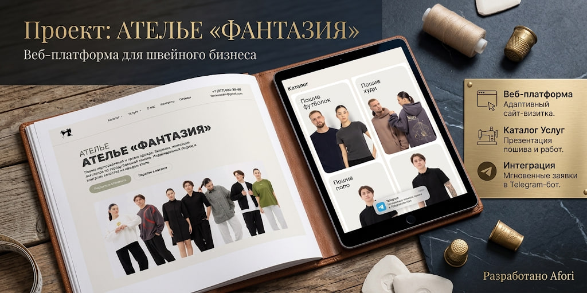
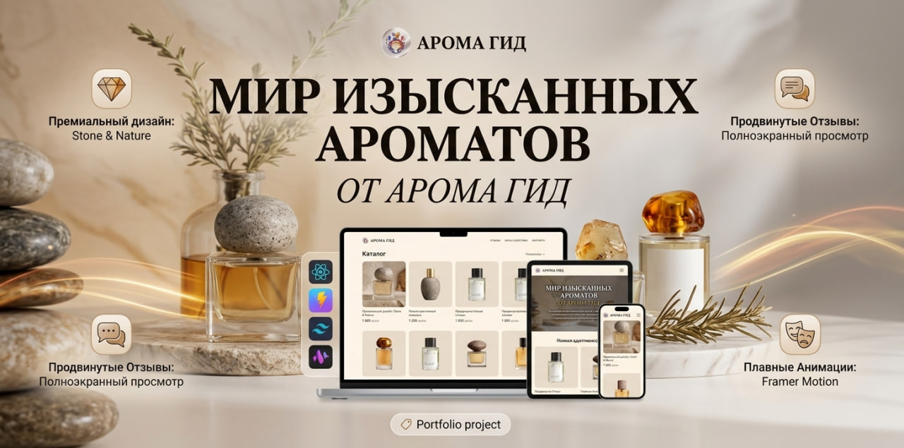

# ✦ Afori | Fullstack Engineer
### *Python • AI/RAG • Web Architecture • Telegram Ecosystems*

[🌐 **Посетить сайт-портфолио(в разработке)**](ССЫЛКА) 

---

### ⚡ Обо мне
Разрабатываю высокопроизводительные веб-приложения и бэкенд-системы. Соединяю строгий софт (FastAPI, Rust) с качественным UI/UX дизайном и интерактивными интерфейсами.

### 🛠 Технологический стек

  
  
  
  
  

---

### 🏛 Избранные кейсы и проекты

> **Веб-платформа для швейного бизнеса «Ателье Фантазия»**
> * Адаптивный сайт-витрина с каталогом услуг и мгновенными заявками в Telegram-бот.

  

> **Парфюмерный гид «Арома Гид»**
> * Премиальный дизайн (Stone & Nature), плавные анимации и интерактивный каталог.

  

---

### 📊 Статистика активности

