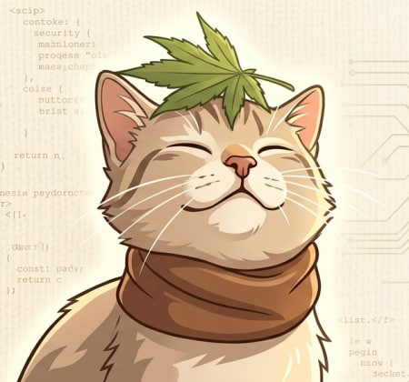

# Привет, я Afori! 👋
### Fullstack Developer | Python • AI & RAG • Web Architect

---

**«Создаю цифровые продукты на стыке эстетики и высокой производительности.»**

---

### 🛠 Мой основной стек

  
  
  
  
  

---

### 🚀 Чем я занимаюсь
* **Backend:** Разработка высоконагруженных систем на Python/FastAPI, проектирование RAG-архитектур и AI-агентов.
* **Frontend:** Создание эстетичных интерфейсов с фокусом на UX и микро-анимации.
* **Automation:** Telegram-интеграции, парсинг данных (Rust-based) и сложная автоматизация бизнес-процессов.

---

### 🌐 Портфолио & Кейсы
*(Здесь будут мои обложки)*
[**Перейти на мой сайт-портфолио(в разработке)**](ССЫЛКА)

---

### 📈 Статистика

  

